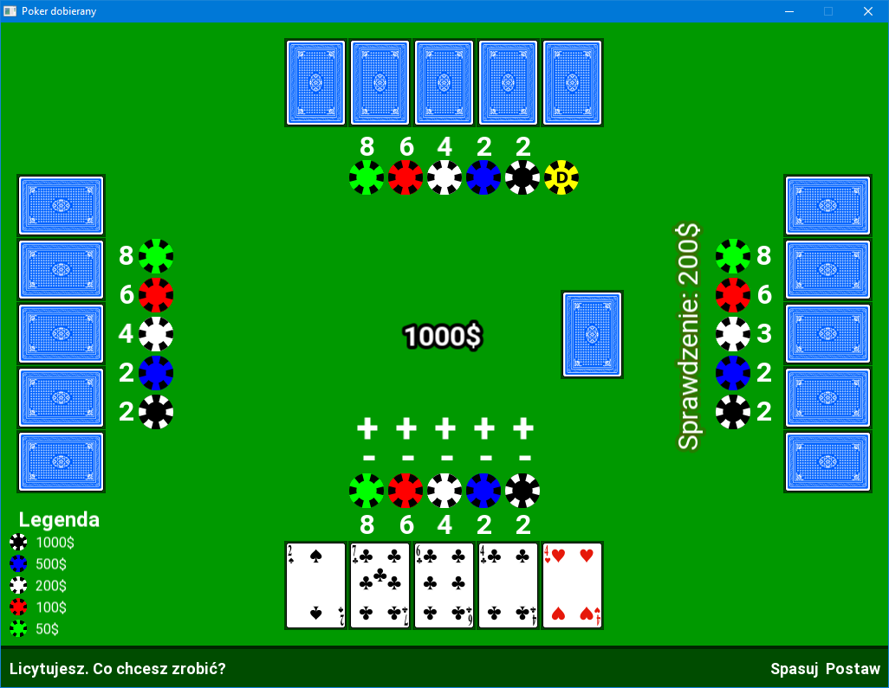

# Poker dobierany (en. Classic Poker)
Copy of project done at Silesian University of Technology.

## Few words about
Project was done on 2nd year of Informatics on Silesian University of Technology. Below you can see how it looks, you can download it too.

Feel free to use some parts of code or making changes (good pull request will be accepted maybe).

Code and comments are written in English, but game has Polish UI (Polish University Project, so Polish language too, you know).

## How to run this?
I was using MinGW, project was created in VS Code so you will probably need to download both (or use yours editor instead) if you want to edit code.

If you want to just run it, download all code. **Copy res directory to bin directory.** and then run *poker.exe*.

If game doesn't start, install MinGW, if starts, but fonts are not loading, copy res dir as I said.

Enjoy!

## Known bugs
Project was created, but not finished in 100%, because of not-too-much-time syndrome. I will not update this, feel free to use or update this code. If you want to play with it, note this:
- Sometimes card blinks for 1/60 of second in upper left corner when shuffling or deal, game use threads, probably something is badly synchronized.
- Computer is stupid, everything is randomized.
- Game is ended after one round, I was trying to add ending screen with an option to next round (continue playing), but not enought time, some sources are not used.
- Texts with inform about PC moves doesn't work properly sometimes, game lose order (check dealer token).

All bugs I know, I described. What wrong, is not me.

Enojy!
